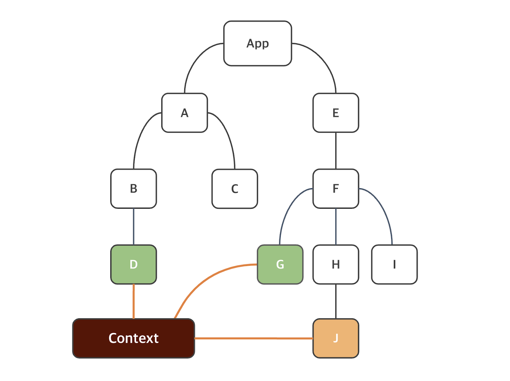

## React Hook
Hook 개념은 React version 16.8 부터 도입됨. 얘를 이용하면 함수 컴포넌트에서 상태와 리액트의 다른 기능을 이용 가능.(예전엔 class 컴포넌트 방식으로만 가능했다.)

얘가 Hook 이라는 것을 명시하기 위한 중요한 규칙들이 몇 가지 있다.
1. 리액트 함수 컴포넌트의 최상위 수준에서 Hook을 호출해야 한다.
2. 반복문, 조건문, 중첩 함수 내에서 훅을 호출해선 안된다(1을 풀이한거다.)
3. Hook은 함수기 때문에 동사로 시작하는데 use로 시작하고 그 뒤에 훅을 사용하는 목적이 따라옴.

### useState
1. Counter 라는 컴포넌트를 생성
2. App.jsx의 return 부분을 전부 다 비우고 Counter 컴포넌트만 삽입.
3. Counter 컴포넌트의 return문은
```jsx
return (<div></div>);
```
로 고정.

```jsx
import { useState } from "react"

function Counter() {
  // 초기값이 0인 상태를 선언.
  const [ count, setCount ] = useState(0);
  return (
    <div>
      <p>버튼 클릭 횟수 = {count} </p>
      <button onClick={ () => setCount(count + 1) }>증가</button>
      <button onClick={ () => setCount(count - 1) }>감소</button>
      <button onClick={ () => setCount(0) }>초기화</button>
    </div>
  )
}
export default Counter;
```
* 참고 사항
html 태그 내에서의 onclick은 전체 소문자인데 반해서 React 상에서의 _이벤트 이름_ 은 카멜 케이스로 작성해야한다 -> onClick

함수는 이벤트 핸들러에 전달되야 하며 사용자가 버튼을 클릭할 때만 함수를 호출한다는 점을 기억해야함. 이상의 경우 화살표 함수를 사용했는데 이는 코드를 더 압축적으로 사용할 수 있으며 그에 따라 코드 가독성이 개선되기 때문이다. 근데 이벤트 핸들러 안에서 함수를 호출하면 컴포넌트가 렌더링될 때 함수가 호출되어 무한 루프가 발생할 가능성이 있다.

```jsx
// 함수가 버튼을 눌렀을 때 호출되는 예시
<button onClick={() => setCount(count+1)}> 증가 </button>

// 함수가 렌더링 중에 호출 되는 예시 -> 무한 루프 걸릴 가능성 있음.
<button onClick={setCount(count+1)}> 증가 {count} </button>
```
```jsx
const count = 0;
console.log(count); // 결과값 : 0
count = setCount(count+1) // 이 부분에서 1 이라는 값이 count 상수에 대입되었다 볼 수 있다.
console.log(count); // 결과값 : 1
```

### 일괄처리(Batching)

React 상에선 상태 업데이트에서 일괄처리를 이용해 리렌더링을 줄임. React 18 이전에는 일괄처리가 버튼 클릭과 같은 브라우저 이벤트 중에 업데이트 되는 상태에서만 가능했었다.

1. MyComponent3 생성
2. App에 MyComponent3 컴포넌트를 삽입해 main -> App -> MyComponent3 로 이어지는 Tree Structure로 구현하여 npm run dev 를 실행 시켜 빈 화면 띄우기.
3. count / count2 라는 상태(State)를 선언하고 각 값을 0으로 초기화.d
4. return 문은 이하와 같다.
```jsx
return (
  <>
    <p> 현재 값: {count} ⭐ {count2} </p>
    <button onClick={}> 증가 </button>
  </>
)
```

```jsx
import { useState } from "react";

function MyComponent3() {
  const [ count1, setCount1 ] = useState(0);
  const [ count2, setCount2 ] = useState(0);
  const increment = () => {
    setCount1(count1 + 1);  // 얘가 먼저 호출 될거니까 얘의 상태가 바뀔 때 리렌더링이 일어나야 하지 않는가
    setCount2(count2 + 1);  // 얘까지 호출 되고 나서 렌더링은 한 번만 일어난다.
  }
  return (
  <>
    <p> 현재 값: {count1} ⭐ {count2} </p>
    <button onClick={() => setCount1(count1 + 1)}> 증가 </button>
  </>
  );
}
export default MyComponent3
```

이상까지의 정리를 바탕으로 했을 때 Counter 컴포넌트에 이하와 같이 increment 함수를 정의한다면 버튼을 한 번 눌렀을 때 + 5 씩 증가하는 것이 아니라 + 1 씩 증가한다.
일괄처리를 한다고 본다면 값이 +1 씩 다섯번이 이뤄지는게 아니라 적어도 +5가 한번에 되야한다는 것을 의미함.

근데 +1 이 한번만 적용되는 결과가 나왔다. 그 부분에 주목.

상태 업데이트는 일괄처리의 개념과 함께 _비동기적으로_ 이뤄진다는 점에 주목.

즉 상태 업데이트 이전에 그 다음 함수가 호출되버렸기 때문에
count = 0인 상태에서 +1 하기 전에 그 다음 setCount()가 호출됐기 때문에 여전히 count의 값이 0에서 +1
한 값이 나오려 헀는데 또 그 값이 업데이트 되기 이전에 다음 함수가 호출되고 ... *5 하는 바람에
결과적으로 버튼 한 번 눌렀을 때 0 + 1에 해당하는 함수가 다섯 번 호출되어 결과값이 1이 나왔다.
```jsx
import { useState } from "react"

function Counter() {
  // 초기값이 0인 상태를 선언.
  const [ count, setCount ] = useState(0);

  const increment = () => {
    setCount(count + 1);
    setCount(count + 1);
    setCount(count + 1);
    setCount(count + 1);
    setCount(count + 1);

  }
  return (
    <div>
      <p>버튼 클릭 횟수 = {count} </p>
      <button onClick={increment}> 증가 { count }</button>
      {/* <button onClick={ () => setCount(count + 1) }>증가</button>
      <button onClick={ () => setCount(count - 1) }>감소</button>
      <button onClick={ () => setCount(0) }>초기화</button> */}
    </div>
  )
}
export default Counter;
```
그렇다면 이상의 문제를 해결하기 위해선 상태 값을 명확하게 조회한 다음 조회한 값에서 +1 을 시켜주면 됨.

해당 방법이
```jsx
  const increment = () => {
    setCount(preCount => preCount + 1);
    setCount(preCount => preCount + 1);
    setCount(preCount => preCount + 1);
    setCount(preCount => preCount + 1);
    setCount(preCount => preCount + 1);
  }
```
이상 처럼 매개변수를 추가해주게 된다면 무조건 (최신화된) count 값을 조회를 해야만 하기 때문에 +5 가 이뤄진다고 담보할 수 있게 된다.

그래서 이까지 진행해주게 되면 vite project를 생성했을 때의 default onClick 형태로 함수가 작성되게 된다.

### useEffect
- useEffect는 React 함수 컴포넌트에서 보조 작업을 수행하는데 이용할 수 있다. 그리고 대부분의 경우엔 fetch 요청이다. 얘의 형식이 중요.
- 형식 :
```jsx
useEffect(callback, [dependencies]);
```
callback 함수엔 보조 작업 로직이 포함되있다(즉 argument가 함수기 때문에 arrow function의 작성 요령의 거의 필수적임.) 두번째 `[dependencies]` 는 의존성을 포함하는 배열로 선택 사항에 해당. 근데 `[]` 로 쓰는 경우들이 있는데 그에 대한 해석이 필요함.

1. Counter2 Component를 생성.
2. App Component 내에 Counter2 컴포넌트 삽입
3. return 구조는 이하와 같다.
```jsx
return (
  <>
    <p>Counter : {count} </p>
    <button onClick = {() => setCount(preCount => preCount + 1)}> 증가 </button>
  </>
);
```
4. 이상을 보면 count를 상태로 선언해야함. 초기값은

```jsx
import { useEffect, useState } from "react";

function Counter2 () {
  const [ count, setCount ] = useState(0);

  useEffect(() => {console.log('Hello ! Changed the state, count ! ')}, [count]);
  
  return (
  <>
    <p>Counter2 : {count} </p>
    <button onClick = {() => setCount(preCount => preCount + 1)}> 증가 </button>
  </>
  );
}
export default Counter2;
```
이상의 컴포넌트가 App에 포함됐을 때 useEffect의 두 번째 argument의 `[]` 의 유무, 혹은 내부 element의 유무에 따라 콘솔창에서 str이 출력되는 횟수 및 방식이 바뀐다는 것을 확인가능.

- 이상에서 알 수 있는 점
  1. `[]` 는 optional이다.(즉 method overloading의 개념이 jsx에도 여전히 존재함.)
  2. `[]` 를 빈 배열로 뒀을 땐 한 번만 콘솔창에 값이 출력됐다.(strictMode에선 두번)
  3. `[count]` 였을 경우엔 `[]` 가 없을 때 처럼 버튼을 누를 때 마다 콘솔에 str이 출력됨.

Component가 함수형으로 이뤄져있다. 즉 렌더링이 일어날 때 마다 App 컴포넌트는 Counter2 컴포넌트를 _호출_ 한다고 할 수 있다. 마찬가지로 Counter2는 useEffect() 함수를 _호출_ 하겠네. 그렇다면 호출 될 때마다 콘솔에 str이 찍혀야 할 것 같은데 2번 상태에선 호출되지 않았다는 점도 문제가 될 수 있다.

그럼 정리했을 때 Counter2가 호출됐을 때 useEffect는 호출됨. 다만 두 번째 argument에 따라서 첫 번째 argument인 callback function이 선택적으로 호출됨.

그럼 1, 3 에서는 계쏙 찍혀나오는데 근본적인 해석이 좀 차이난다.
`[]` 가 없는 경우 : 렌더링이 일어날 때 마다 callback function을 호출. (그럼 count 값이 바뀔 때 마다 callback 함수가 호출 되겠네.)

`[count]` 로 작성한 경우 : count 값이 바뀔 때 마다 callback function을 호출
`[]` 로 작성하는 경우 : 첫 번째 렌더링 시에만.

useEffect() 훅에는 콜백 함수가 모든 렌더링에서 실행되지 않게 하는데 이용할 수 있는 두 번째 optional argument인 배열이 존재함. count값 혹은 count2를 통해서 통제했었다. 즉 `[count]` 라면 count 값의 변화(즉 상태의 변화) 가 있을 때 마다 useEffect의 callback 함수가 호출되도록 정의했었다.

그리고 `[]` 라면 useEffect()의 callback 함수는 첫 번째 렌더링 후에만 실행됨.

그리고 이하의 예시에선 useEffect()가 모든 보조 작업(callbcak 함수) 이전에 실행되는 정리 함수를 return 하는 것도 가능. 이 메커니즘을 이용하면 다음 번에 보조 작업을 실행하기 전에 이전 렌더링에서 각 효과를 정리하는 것이 가능. 보통은 구독, 타이머 또는 예기치 않은 작동을 방지하기 위해 정리해야하는 리소스를 설정할 때 유용함. 정리 기능은 페이지에서 컴포넌트 자체를 제거(또는 mount 해제) 한 후에도 실행됨. (현재 수준엔 적용 x)

```jsx
import { useState, useEffect } from 'react';

function Counter3 () {
  const [ count, setCount ] = useState(0);
  useEffect(() => {
    console.log('Hello from useEffect ! ');
    return () => {
      console.log('clean up function 정리 함수 ');
    }
    
  }, [count]);

  return (
    <>
      <p>Counter3 : {count} </p>
      <button onClick = {() => setCount(preCount => preCount + 1)}> 증가 </button>
  </>
  )
}
export default Counter3;
```
이상과 같은 상태로 실행했을 경우 최초 렌더링 시에 strcitMode로 인해 Hello from useEffect - clean up function - Hello from useEffect가 실행되는 것을 확인 가능.

그 이후엔 버튼을 누를 때 마다 정리 함수가 먼저 호출되고 그 다음 다시 hello from useEffect가 출력되는걸 확인했을 때 값이 바뀌고 - 정리 함수 호출하고 - 다시 컴포넌트를 렌더링하는 시간적 순서가 있다고 볼 수 있다.

### useRef
- 해당 훅은 DOM 노드에 접근하는데 이용할 수 있는 _변경 가능한 ref 객체_ 를 return
- 형식 :
```jsx
const ref useRef(initialValue);
```
useRef()의 return 값은 ref에는 argument로 초기화된 속성이 있다(이상엔 initialValue). 이상의 예제에선 inputRef 객체를 생성해서 null로 초기화했고 JSX 요소의 ref속성을 이용해 ref 객체를 전달했다.
`<input ref={inputRef} />` 부분에 해당함. 버튼을 클릭했는데 버튼이 활성화 되는게 아니라 input창이 활성화된거라고 볼 수 있다. DOM 요소가 먼말인지 헷갈리면 JavaScript 부분 수업할 때의 DOM 요소 조작 부분과 관련있다. JavaScript에서 getElementById() 등을 통해서 해당 HTML 요소를 불러왔던 것 처럼 useRef(null)인 상태에서 ref={inputRef}를 통해 앞으로 input창을 참조하라고 재대입을 해줬다고 생각하면 그나마 이해하기 편함. 이제 input 요소가 button 요소 내 callback 함수에 포함되고 current 속성을 이용해 input 요소의 focus 함수를 호출하는 것이 가능. _`<button onClick={() => inputRef.current.focus()}`)>` 에 해당하는 부분임_

그래서 버튼 눌렀을 때 버튼이 활성화 되는 것이 아니라 input 요소가 활성화된다.

### Custom Hook
React에선 사용자 정의 Hook 함수를 정의할 수 있다. 원칙에서 나온 것 처럼 use로 시작해야하며 기본적으론 JavaScript 함수다. 마찬가지로 Custom Hook 내에서 다른 Hook을 호출하는 것도 가능함. 얘를 쓰면 컴포넌트 내에서의 코드의 복잡성을 줄일 수 있다.

1. useTitle.js
2. Counter4.jsx 생성
3. code 확인

## Context API

과제
1. 새 vite-project 를 만든다. 어제자 MD 파일 확인하면 만드는 방법 있다.
2. 프로젝트 명은 mycontextapi / framework는 React / language는 JavaScript로 만든다
3. github에 push 한다.
  - 주의 사항 : 잘못 push 하면 myapp이 날라가고 mycontextapi만 올라가는 문제가 생길 수 있다.
  - 어떻게 해야했는지 잘 고민해바라.
4. default screen을 띄워둬라.
5. title을 'ContextAPI 학습' 으로 고쳐라.

- 컴포넌트 Tree Structure가 깊고 복잡하다면 props을 이용해 데이터를 전달하는 것이 번거로울 수 있다. 컴포넌트 트리의 모든 컴포넌트를 통해 데이터를 전달해야 하기 때문이다. 예를 들어

이상의 그림 참조.
그럼 `상위 컴포넌트` → `하위 컴포넌트` 로의 일방향으로만 데이터 이동이 가능한 React 자체의 특성 상, 중간 단계의 컴포넌트들은 자신이 사용하지 않을 데이터를 _전달_ 용도로 받아오고 또 자신의 하위 컴포넌트로 이동시켜야만 하는 문제점이 발생함.

이상의 문제를 해결하기 위한 방법이 Context API의 도입으로 테마나 인증된 사용자 등 컴포넌트 트리의 여러 컴포넌트에 필요할 수도 있는 전역 데이터들을 보관하는 컨테이너 역할을 한ㄷ.

이하의 그림을 참조.


그럼 Context에 저장되있는 전역 데이터들은 컴포넌트의 위계와 관계없이 필요 하에 컨테이너 내에 있는 데이터를 참조하거나 편집하는 것이 가능함.

이를 사용하기 위한 코드 작성 예시는 다음과 같다.

1. Context는 기본값을 설정하기 위한 argument를 받는 createContext() 메서드로 생성함. 컨텍스트에 대한 파일을 직접 만들 수 있고 예시는 다음과 같다.
```js
// AuthContext.js
import React from 'react';

const AuthContext = React.createContext('');

export default AuthContext;
```
2. Context.Provider 컴포넌트를 이용해 다른 컴포넌트에서 전역 데이터들을 이용할 수 있도록 한다. 여기서 중요한 점은 어느 범위에 있는 컴포넌트들이 이 전역 데이터에 접근할 수 있는가를 설정할 수 있다는 점이다.

먼저 일반적인 손자 하위 컴포넌트에 username을 전달하는 과정임.
```jsx
// App.jsx
import MyComponent from './MyComponent'
import './App.css'

function App() {

  const username = '김일';
  return (
      <MyComponent username={username}/>
  )
}

export default App
```

```jsx
// MyComponent.jsx
import Hello from "./Hello"


function MyComponent(props) {
  return (
    <>
      <Hello username={props.username}/>
    </>
  );
}

export default MyComponent
```

```jsx
// Hello.jsx
function Hello([props]) {
  return (
    <>
      안녕하세요, {props.username}님!
    </>
  )
}

export default Hello
```

이상이 일반적인 형태의 props 전달 과정에 해당함.

그리고 ContextAPI를 적용한 형태는 현재 mycontextapi 프로젝트에 작성되있다.

대체품으론 Recoil을 쓸 수 있다.

## 리액트 목록 처리
여기서 다시 .map() 메서드를 다룰 예정

.map() : 기존 배열의 각 element들에게 callback 함수를 호출한 결과를 포함하는 _새 배열_ 을 만들어냄
```js
const arr = [1,2,3,4];
const newArr = arr.map()
```

```jsx
import React from "react";
import AuthContext from "./AuthContext";

function MyList() {
  const username = React.useContext(AuthContext);
  const data = [1, 2, 3, 4, 5, 6, 7, 8, 9, 10];
  return (
    <>
      <ul>
        {
          data.map((element , index) =>
          <li key = {index} >List Item : {element}</li>
        )
        }
        </ul>
      <p>안녕히 가세요. {username}님!</p>
    </>
  )
}

export default MyList;
```

이상의 예제 코드는 컴포넌트의 정수 배열을 ul list의 자식 태그에 해당하는 `<li>` 태그로 각각의 element들을 불러왔다.

React list 항목엔 row가 추가, 업데이트, 삭제됐는지 감지하는데 이용하는 고유 키(unique key)가 필수적 요구됨(JS 자체에선 아님) 그래서 .map() 메서드의 두 번째 argument로 index를 사용해 경고를 처리했다.

* 참조 : 목록 순서를 바꾸거나 항목을 추가 또는 삭제할 경우 index 값이 멋대로 바뀌게 될 수 있으므로 사실 index를 통해 key 설정을 하는 것은 권장안함. 대신 데이터의 unique key를 별개로 설정해 집어 넣는 것이 더 적절함.

근데 매번 별개로 만들어두는 것이 귀찮아서 uuid와 같은 고유 id를 생성하는데 이용할 수 있는 라이브러리가 별개로 존재함.

- uuid를 검색하여 벨로그 및 생성형 AI에게 물어볼 것.

2. MyTable.jsx 생성 그리고 MyList 날리고 MyTable로 갈아끼워라.

```jsx
// MyTable
function MyTable() {
  const data = [
    {id: 1, brand: '기아', model: '셀토스'},
    {id: 2, brand: '현대', model: '그랜저'},
    {id: 3, brand: '아우디', model: 'A8'},
  ]
  return (
    <>
      <table>
        <tbody>
          {
            data.map((item) =>
              <tr key={item.id}>
                <td>{item.brand} : </td>
                <td>{item.model} </td>
              </tr>
            )
          }
        </tbody>
      </table>
    </>
  )
}

export default MyTable;
```
데이터가 객체의 배열이라면 테이블 형식으로 표기하는 편이 좋을 것 같다(그냥 리스트로 해도됨.) 사전 data에 id값을 연결해 tr 태그에 고유값인 key 속성을 채워넣었다. 이는 향후 DB와의 연결을 고려한 방식 코딩임.

## 리액트 이벤트 처리
리액트의 이벤트 처리는 DOM 요소 이벤트 처리와 거의 유사함. HTML 이벤트 처리와 다른 점은 이벤트를 지정할 때 카멜 케이스를 사용한다는 점이다.(onclick =/= onClick)

```jsx
function MyComponent2() {
  // 버튼을 눌렀을 때 호출되는 함수를 하나 정의함.
  const handleClick = () => {
    alert('Button pressed !');
  }
  return (
    <>
      <button onClick={handleClick}> Press Me ! </button>
    </>
  );
}
export default MyComponent2
```
어제 마지막 시간 오늘 첫 시간에서 학습했던 것 처럼 함수를 _직접 호출_ 하는 것 대신에 함수 이름을 이벤트 핸들러(onClick)에 전달해야 한다. 이제 handleClick 함수는 return문 외부에 정의되있어 함수 이름을 이용해 함수를 참조하는 것이 가능함.(오늘 increment 함수 정의 했을 때 사용한 방법이다.)

지난번 시험에서 html /css / js 를 활용해 회원 가입을 구현할 때 form을 사용했었다.

폼 제출하게 되면 default 형태로 새 창이 뜬다거나 하는 부분이 있다. 근데 SPA에선 새창으로 넘기는 일 없이 그대로 갱신이 되야해서 새창이 뜨는 것을 막는 메서드가 추가적으로 존재하는데 이를 preventDefault()라고 한다.

MyForm.jsx 생성
만들고 나서 default 작업 처리하고 App.jsx에 MyForm에 추가.

```jsx
function MyForm() {
  // Form이 제출될 때 호출될 수 있도록 작성

  const handleSubmit = (event) => {
    event.preventDefault(); // md파일에서 작성한 기본 동작 방지 메서드
    // 그럼 onSubmit에 딸려있는 default는 양식 제출이다. -> DB나 백엔드로
    alert('제출 시에 나오는 경고창 입니다.')
  }
  return (
    <>
      <form onSubmit={handleSubmit}>
        <input type="submit" value="제출!" />
      </form>
    </>
  );
}
export default MyForm
```
이상의 이벤트 핸들러에서 onClick / onSubmit에 관련된 부분을 학습했다.
중요한 점은 각 태그를 카멜케이스로 작성한다는 점, 함수를 callback 함수로 호출하거나 혹은 컴포넌트 내에 변수 형태로 함수를 정의한 후 함수의 이름만 이용해 결과값이 아니라 함수 자체를 참조할 수 있게끔 작성한다는 점이다.

이상의 경우에서 공통적으로 handle+이벤트명을 사용했다.

오래된 자료를 보게 될 경우 clickHandler 라는 표현을 쓰기도 하지만 최근엔 대부분 handle + 이벤트명 으로 바뀌는 추세다.

## 리액트 폼 처리